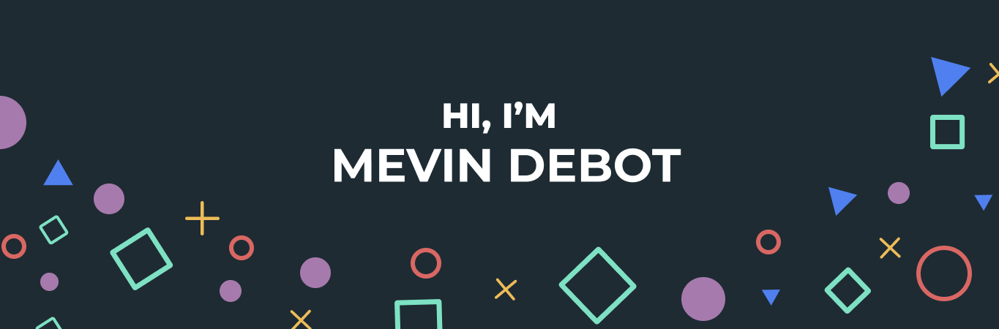

Hey there 👋

- 🔭 I’m currently working on [Exceenis](https://www.exceenis.com/)

- 🤝 I’m looking for help with **an IOT project**

- 👨‍💻 All of my projects are available at [https://www.melvindebot.com/#/](https://www.melvindebot.com/#/)

- 💬 Ask me about **react, vue, gsap**

- 📫 How to reach me **melvin.debot@hetic.net**

- 📄 Know about my experiences [https://fr.linkedin.com/in/melvin-debot-b22078173](https://fr.linkedin.com/in/melvin-debot-b22078173)

- ⚡ Fun fact **I think i am funny**

Want to know more about me? [Check out my portfolio.](https://www.melvindebot.com/#/)

## 📌 Pinned Repositories

 

## &#x1f4c8; GitHub Stats

 

 
 

## 💼 Skills

More Skills

 

 

## Technology monitoring

 

